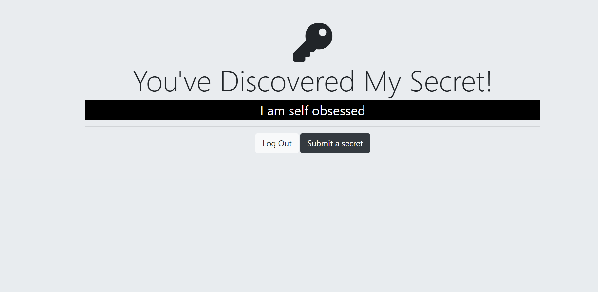

# SecretiveSocial

SecretiveSocial is a web application that allows users to share secrets anonymously with others. Users can register, login, submit their secrets, and view secrets shared by others without revealing their identities.

---


---

# Preview



## Features

- **User Authentication**: Users can register with a username and password, and existing users can log in securely.
- **Anonymous Secrets**: Users can submit secrets without revealing their identity.
- **View Secrets**: Users can view secrets shared by others on the platform.
- **Google OAuth2**: Users can also authenticate using their Google accounts for convenience.

---

## Installation

1. Clone the repository:  https://github.com/KRISHNAKUMARPS2002/SecretiveSocial.git
2. Navigate to the project directory: cd SecretiveSocial
3. Install dependencies: npm install


4. Set up environment variables:
- Create a `.env` file in the root directory.
- Add the following environment variables:
  ```
  SESSION_SECRET=your_session_secret
  PG_USER=your_postgres_username
  PG_HOST=your_postgres_host
  PG_DATABASE=your_postgres_database
  PG_PASSWORD=your_postgres_password
  PG_PORT=your_postgres_port
  GOOGLE_CLIENT_ID=your_google_client_id
  GOOGLE_CLIENT_SECRET=your_google_client_secret
  ```

---

## Usage

1. Start the server: npm start
2. 
2. Open your browser and navigate to `http://localhost:3000` to access the application.

---

## Technologies

- Node.js
- Express.js
- PostgreSQL
- Passport.js (Local and Google OAuth2 strategies)
- EJS (Embedded JavaScript) for views
- bcrypt for password hashing
- dotenv for managing environment variables

---


